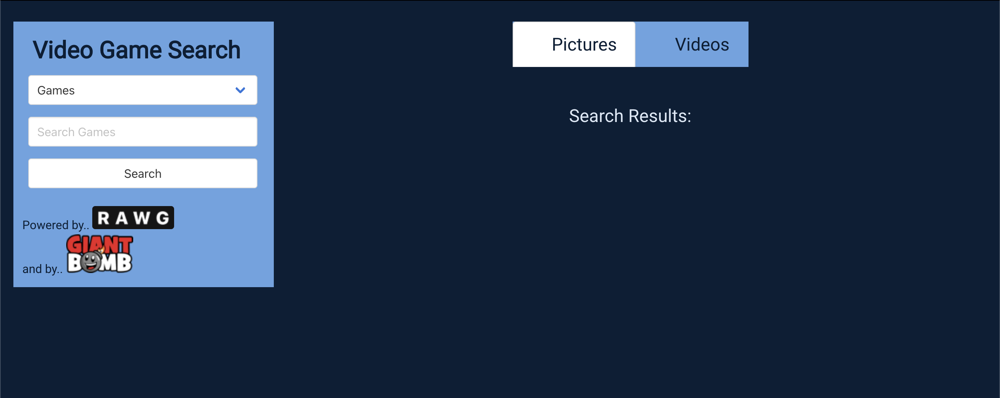
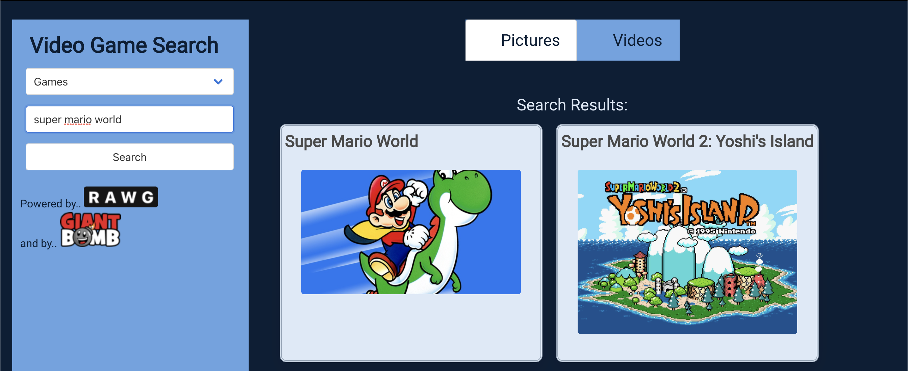
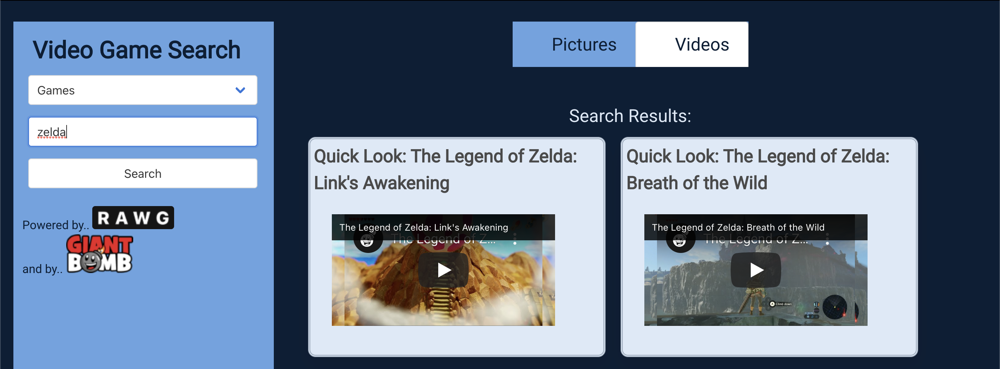

# Project 1 - Video Game Search Engine

## User Story

```
AS A video game hobbyist 
I WANT to research games for new information and videos 
SO THAT I can become a better gamer
```

## Acceptance Criteria

```
GIVEN I am using search engine to find information
WHEN I enter search criteria
THEN the results will be displayed 
WHEN I click a video
THEN the video begins playing
```

## Description

  We created a search engine that can find images and videos for your favorite video games. For students new to web development learning how to use and design an application around an api can be challenging so trying to make two work together made things much more difficult. We knew we wanted to make some form of search engine. But narrowing down the subject was a different story. We went from Marvel characters to general super heroes and eventually landed on video games. While the end result might not have been exactly what we were looking for at least we were able to adapt and create something we were satisfied with and hope you are able to use it to travel through your own rabbit hole of images and videos around the web.

## Technologies Used

  RAWG - Video Games Database. Keep all your games in a unified profile to create your own collection.
  https://api.rawg.io/docs/

  Giant Bomb - Video Game Website and Wiki. Personality driven gaming content.
  https://www.giantbomb.com/api/

  Bulma - CSS Framework. Simpler alternative to Bootstrap.
  https://bulma.io/

## Screenshot

  

  

  

## Future Expansion

  We'd like to be able to implement highly detailed search cards to include more information for a specified game including news, reviews, ratings, player streams and a number of other options.

## Contributers

* https://github.com/elliott-steven

* https://github.com/karizmatik215

* https://github.com/patelg1

## Application Links

* The URL of the deployed application.
  
  https://elliott-steven.github.io/project1-videogamesearch/

* The URL of the GitHub repository.
  
  https://github.com/elliott-steven/project1-videogamesearch
